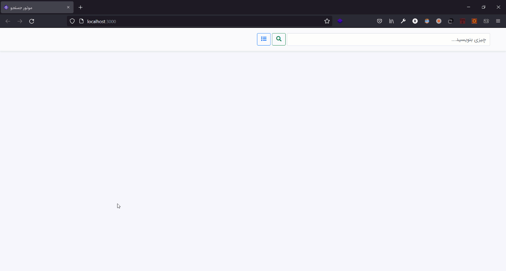

# Search Engine

Implementation of a Small Search Engine With `Node.js` and `MongoDB`

## Author

**Rabist** - view on [LinkedIn](https://www.linkedin.com/in/rabist)

## Details

-   **Course:** Web Information Retrieval - Undergraduate
-   **Teacher:** [Dr. Ali Mohammad Zare](https://yazd.ac.ir/en/people/zareh)
-   **Univ:** Yazd University
-   **Semester:** Summer 1400

## License

Licensed under [MIT](LICENSE).
